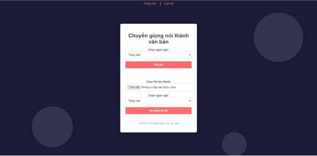
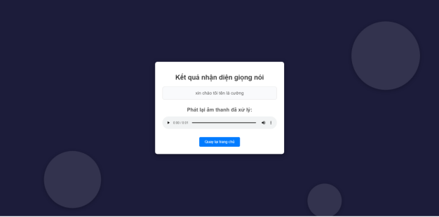
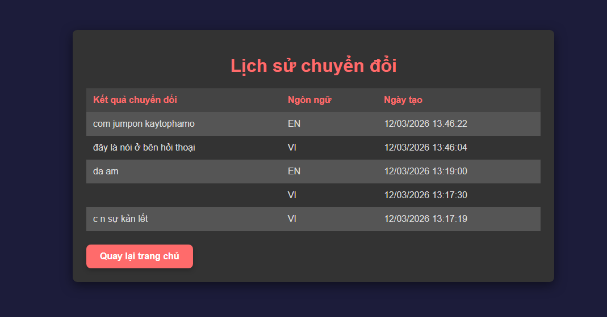

# 🎙️ Speech-to-Text AI Web Application

A full-stack web application that converts spoken audio into text using 
pre-trained Wav2Vec 2.0 models — supporting both Vietnamese and English.

---

## 🖼️ Demo

### Giao diện chính


### Kết quả nhận diện


### Lịch sử chuyển đổi


---

## 🔍 About

Built with Django and HuggingFace Transformers. Users can record directly 
in the browser or upload `.wav` files for transcription. All results are 
stored in MongoDB and viewable in the history page.

**Models used:**
- 🇻🇳 Vietnamese: `khanhld/wav2vec2-base-vietnamese-160h`
- 🇬🇧 English: `jonatasgrosman/wav2vec2-large-xlsr-53-english`

---

## 🚀 Features

- 🎙️ Record speech directly in the browser
- 📂 Upload `.wav` / `.mp3` audio files
- 🔤 Transcribe in Vietnamese or English
- 📝 View transcription history with timestamps
- 🔊 Audio playback after processing

---

## 🛠️ Tech Stack

| Layer | Technology |
|-------|-----------|
| Backend | Python, Django |
| Frontend | HTML, CSS, JavaScript |
| AI Models | HuggingFace Wav2Vec 2.0 |
| Database | MongoDB (PyMongo) |
| Audio Processing | librosa, pydub, noisereduce |

---

## 📦 Installation
```bash
# 1. Clone repo
git clone https://github.com/Sickked-C/Speech-Recognition-Web.git
cd Speech-to-Text-AI-Web-Application

# 2. Tạo virtual environment
python -m venv .venv
.venv\Scripts\activate        # Windows
source .venv/bin/activate     # Mac/Linux

# 3. Cài dependencies
pip install -r requirements.txt

# 4. Tạo file .env
cp .env.example .env
# Điền SECRET_KEY, MONGO_URL, DB_NAME vào file .env

# 5. Migrate và chạy
python manage.py migrate
python manage.py runserver
```

Truy cập **http://localhost:8000**

---

## ⚙️ Environment Variables

Tạo file `.env` ở thư mục gốc với nội dung:
```
SECRET_KEY=your-secret-key-here
DEBUG=True
ALLOWED_HOSTS=localhost,127.0.0.1
MONGO_URL=mongodb://localhost:27017
DB_NAME=stt_db
```

---

## 📁 Project Structure
```
.
├── STT_test/              # Django project config
│   ├── settings.py
│   ├── urls.py
│   └── wsgi.py
├── audio_processor/       # Main app
│   ├── templates/         # HTML templates
│   ├── views.py           # Core logic & model inference
│   ├── mongo.py           # MongoDB connection
│   └── urls.py
├── docs/                  # Screenshots for README
├── media/                 # Generated audio files (git-ignored)
├── .env                   # Environment variables (git-ignored)
├── requirements.txt
└── README.md
```

---

## 🗺️ Roadmap

- [x] Vietnamese & English transcription
- [x] Browser recording + file upload
- [x] Transcription history with MongoDB
- [ ] Add OpenAI Whisper as alternative backend
- [ ] Dockerize and deploy to Render

---

## 📄 License

MIT License